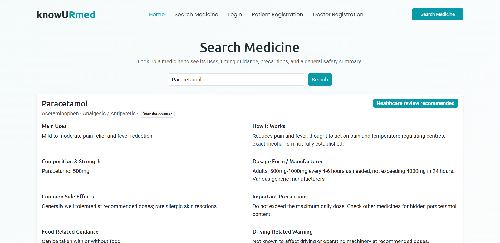

# KnowUrMed: understand your medicines before you take them

[](https://github.com/peeyushp00-create/knowurmed/actions/workflows/ci.yml)
[](LICENSE)


KnowUrMed explains medicines and prescriptions in plain language. Search a medicine to see what it's for, how to take it and what to watch out for, shown as clear safety cards instead of a misleading single "score". Patients can upload a photo of a prescription, have the medicines read automatically, and confirm each one. Doctors and admins get their own dashboards for appointments, approvals, complaints and feedback.

> **Medical disclaimer.** KnowUrMed is an educational tool. It does not diagnose, prescribe or replace professional advice. Always confirm dosing and interactions with your doctor or pharmacist. Where verified information isn't available, the site says "Information unavailable" rather than guessing.

## Run it locally

You need **Python 3.12 or newer** ([python.org](https://www.python.org/downloads/) — on Windows, tick *"Add Python to PATH"* during install). No database server is needed: it uses SQLite.

```bash
git clone https://github.com/peeyushp00-create/knowurmed.git
cd knowurmed
python -m venv .venv
.venv\Scripts\activate            # Windows
# source .venv/bin/activate       # macOS / Linux
pip install -r requirements.txt
python manage.py migrate
python manage.py seed_medicines    # loads the medicine catalog
python manage.py createsuperuser   # your admin account
python manage.py runserver
```

Open the link printed after **"Starting development server at"** in your terminal and log in with the admin account you created. New patients and doctors register from the site and appear in the admin dashboard for approval.

## Screenshots



## Features

- **Medicine search with autocomplete**: by brand or generic name, with composition, dosage, side effects, precautions, and guidance on food, driving, pregnancy, breastfeeding, kidney and liver conditions, storage, missed doses, serious warning signs and sources.
- **Safety summary cards**: one card per topic (food, driving, pregnancy, breastfeeding, kidney, liver, allergy, age, interactions, duplicate ingredients), each with a status (*Low concern* → *Healthcare review required*, or *Information unavailable*), an explanation, a next step, a source and a review date.
- **Prescription upload and review**: drag-and-drop or camera upload (JPG, PNG, PDF). Text is read with Tesseract OCR, and medicine name, strength, frequency and duration are detected and fuzzy-matched against the verified catalog. Every detected medicine must be confirmed, edited or removed before the prescription counts as confirmed, and medicines can be added by hand.
- **Three role-based portals**: patients, doctors and admins, with admin approval for new accounts.

## Security and privacy

- **Every page checks who you are.** Pages are restricted by role (`app/permissions.py`): anonymous visitors are sent to the login page, the wrong role gets a 403, and an account that loses its approval is signed out on its next request. A test covers every page for every role.
- **Prescriptions are private.** Uploaded files are never served from a public URL — only through a view that checks the logged-in patient owns them. Anyone else gets a 404, so they can't even tell the file exists.
- **Uploads are checked by content**, not just by name: images are opened and verified, PDFs must start with a real PDF header, and files are limited to 10 MB.
- **Passwords** go through Django's password validators at registration and when changed.
- **Data-changing actions only accept POST** with CSRF protection.
- **Secrets stay out of the code**: settings come from environment variables, and the app refuses to start with debug off unless a secret key is set.
- Prescriptions can be deleted from the review screen, and `python manage.py cleanup_old_prescriptions --days N` removes old uploads in bulk.

## Prescription reading (optional)

Without OCR, everything still works: patients upload the prescription and type the medicines in on the review screen. To turn on automatic reading, install:

- **Tesseract OCR**: Windows `winget install -e --id UB-Mannheim.TesseractOCR` · macOS `brew install tesseract` · Ubuntu `sudo apt install tesseract-ocr`
- **Poppler**, only for PDF uploads: Windows `winget install -e --id oschwartz10612.Poppler` · macOS `brew install poppler` · Ubuntu `sudo apt install poppler-utils`

On Windows, Tesseract's default install folder is found automatically. If yours is elsewhere, or Poppler isn't on your PATH, copy `.env.example` to `.env` and set `TESSERACT_CMD` / `POPPLER_PATH`.

## Tests

```bash
python manage.py test
```

The suite covers the who-can-open-what table for every page and role, registration and login (including approval and password rules), medicine search, appointments, complaints and feedback, prescription upload validation, the review flow, privacy between patients, the OCR parser, and a real OCR run on a sample prescription (skipped when Tesseract isn't installed). GitHub Actions runs it on Linux and Windows with Python 3.12 and 3.13, along with `ruff` and a check for missing migrations.

## Configuration

Everything works without configuration for local use. To change settings, copy `.env.example` to `.env`:

| Setting | Default | Purpose |
| --- | --- | --- |
| `DJANGO_DEBUG` | `True` | Set to `False` in production |
| `DJANGO_SECRET_KEY` | dev-only key | **Required** when debug is off |
| `DJANGO_ALLOWED_HOSTS` | your own computer, in debug | Comma-separated host names |
| `DB_ENGINE` | SQLite | Set to `mysql` (and the `DB_*` values, plus `pip install mysqlclient`) to use MySQL |
| `TESSERACT_CMD`, `POPPLER_PATH` | auto-detected | OCR tool locations |

## Technology

- **Backend**: Django 6 (Python), server-rendered templates
- **Database**: SQLite by default, MySQL supported
- **OCR**: Tesseract via `pytesseract`, `pdf2image` for PDFs, regex + fuzzy matching against the catalog (no AI model guesses)
- **Frontend**: Bootstrap 5, plus a custom component set for the admin dashboard
- **Quality**: Django test suite, `ruff`, GitHub Actions

See [`docs/ARCHITECTURE.md`](docs/ARCHITECTURE.md) for the models, roles, views and templates.

## Roadmap

1. ~~Landing page, extended medicine database, search with autocomplete, safety summaries~~
2. ~~Prescription upload (image/PDF), OCR extraction, confirm/edit review screen~~
3. ~~Security pass: role-based access on every page, automated test suite, CI~~
4. Prescription explainer dashboard, daily medication schedule, interaction checker
5. Optional health profile, personalised safety checks, printable report, conversational assistant
6. Admin content management with audit logging, OCR-failure review queue

## Contributing

Issues and pull requests are welcome. For anything larger than a small fix, please open an issue first so the change can be scoped against the roadmap. Run `python manage.py test` and `ruff check .` before submitting.

## License

[MIT](LICENSE) © 2026 Peeyush
